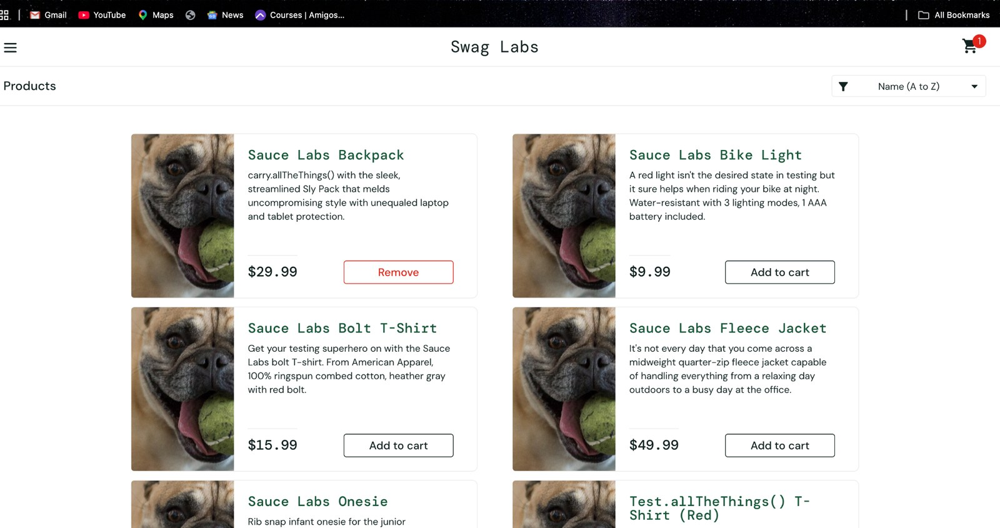

# Bug Reports

## Application
Swag Labs (SauceDemo)

## Testing Type
Manual Functional Testing

## Environment
- Browser: Google Chrome
- Platform: macOS
- Application: Swag Labs

---

## BUG-001: Incorrect Product Image Displayed for Products

### Summary
Incorrect product image is displayed for multiple products when logged in as `problem_user`.

### Severity
Medium

### Priority
Medium

### Module
Products / Product Listing

### Preconditions
User is logged in with `problem_user`.

### Steps to Reproduce
1. Open the Swag Labs application.
2. Log in using `problem_user`.
3. Navigate to the Products page.
4. Observe the product images displayed for the products.

### Test Data
- Username: `problem_user`
- Password: `secret_sauce`

### Expected Result
Each product should display an image that corresponds to the respective product.

### Actual Result
The same pug image is displayed for multiple products, including the Sauce Labs Backpack, instead of the corresponding product images.

### Status
Open

### Evidence
Screenshot captured during manual testing.
### Screenshot Evidence

